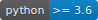

# browser_forensics

   

This is a forensic tool written in Python 3. Use this tool to  fetch the content of the *history* file (Firefox, Chrome and Safari) on macOS and Windows 10 operating systems.

## Supported OS

* macOS
* Windows 10

## Supported Browser

* Chrome
* Firefox
* Safari

## Usage

Change to the *browser_forensics* directory and start the program with

    # Chrome browser
    python browser_forensics.py -c

or

    # Firefox browser
    python browser_forensics.py -f

or

    # Safari browser
    python browser_forensics.py -s

Since this is a program written in Python 3 you may use

    python3

on UNIX-like systems.

## ToDo

* Add list with installed browsers
* Add Linux support
* Add data export (CSV, JSON, Excel?)
* Add more Unit Tests

## Changelog

* **10.11.2018**, *Version 1.1.0*: This version supports Chrome and Firefox on macOS and Windows 10.
* **03.12.2018**, *Version 1.2.0*: Added support for the Safari browser.
* **25.02.2019**, *Version 1.2.1*: Added tests
* **20.05.2019**, Version 1.2.2*: Fixed bugs
